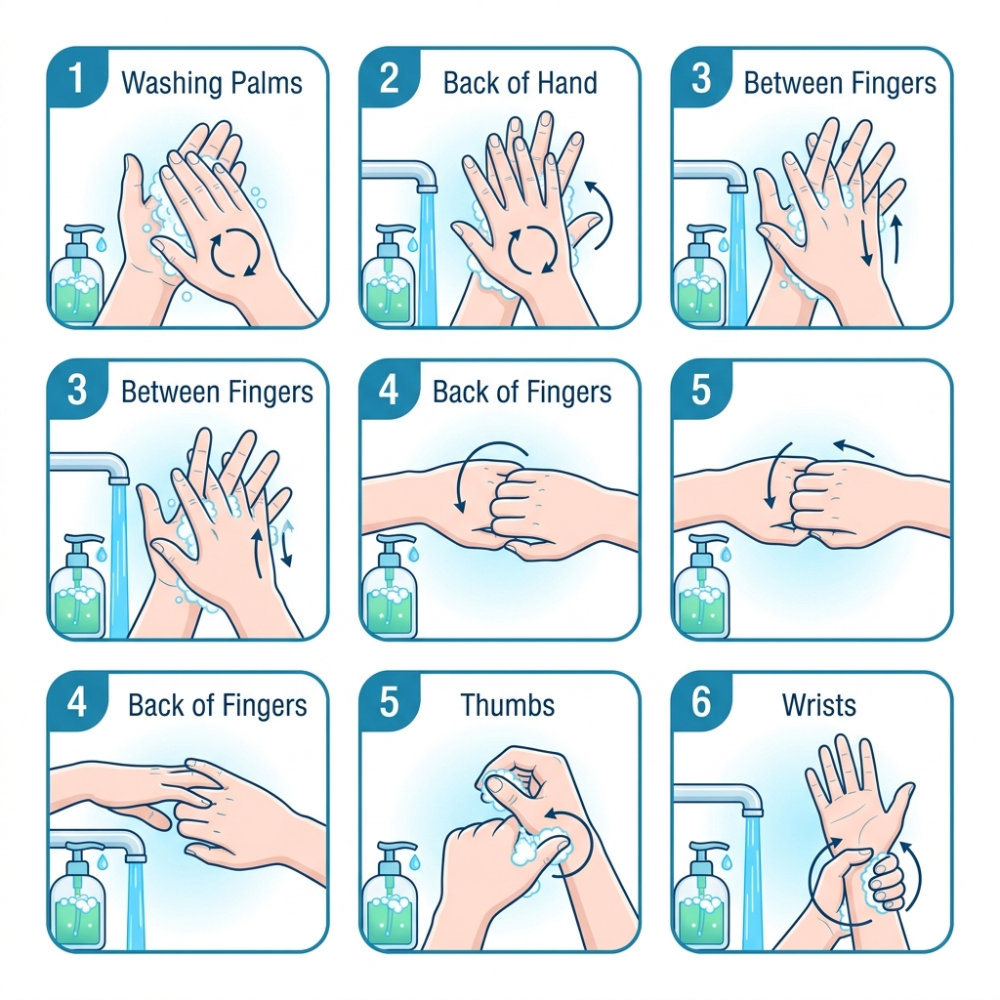
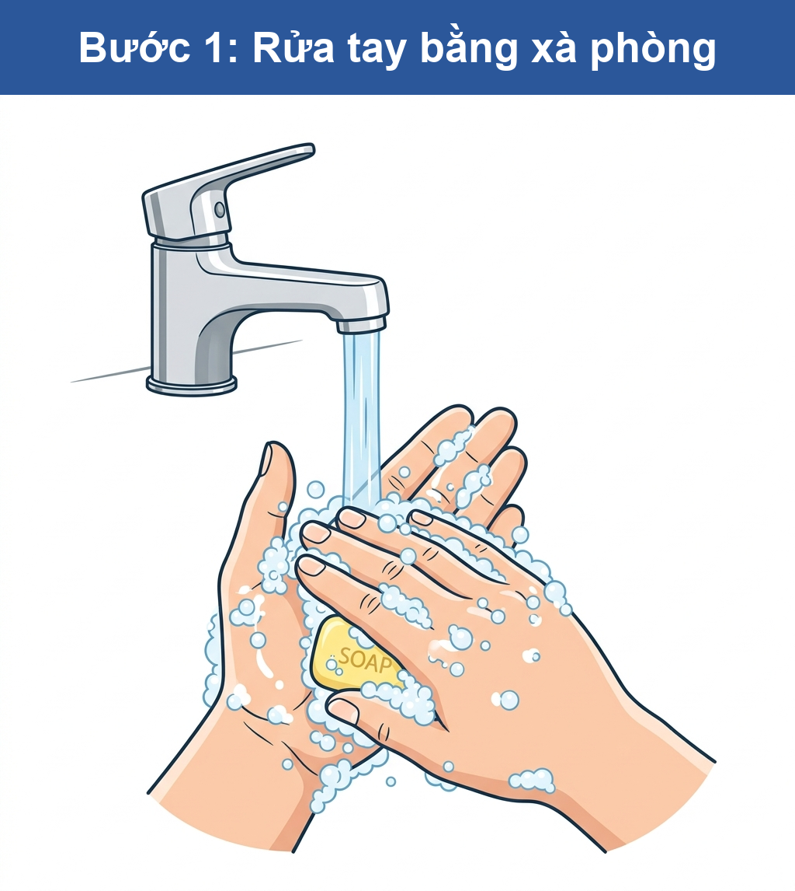
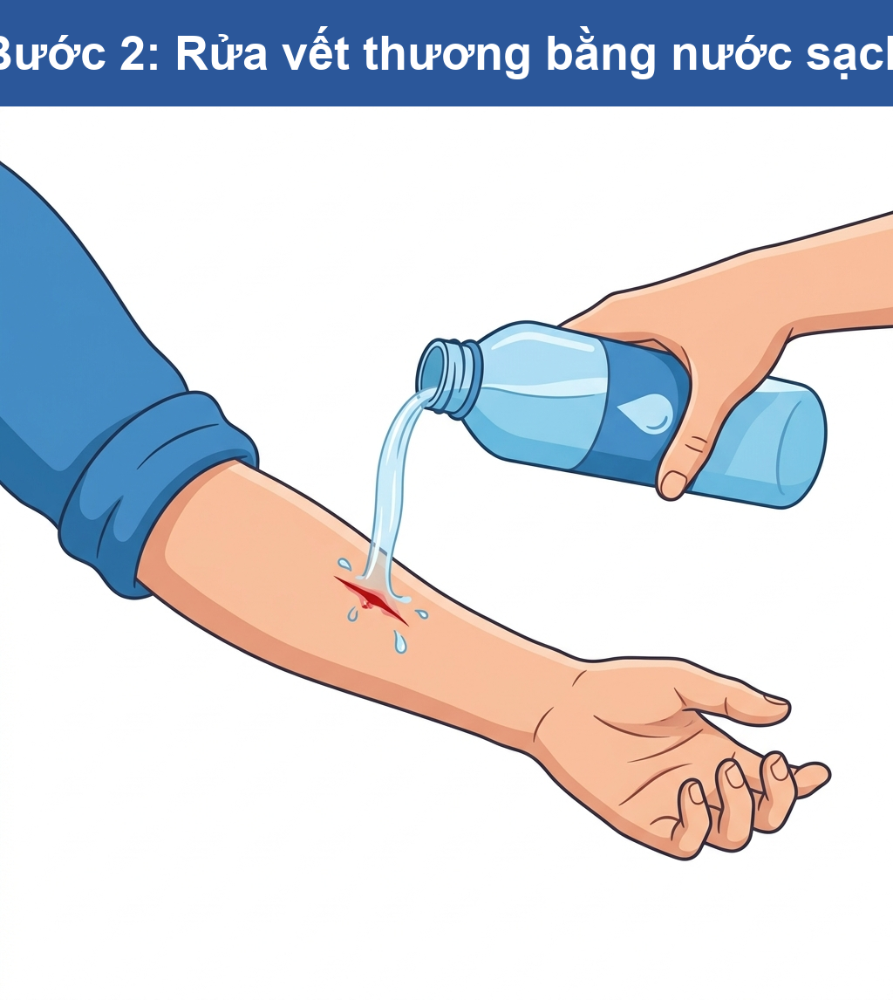
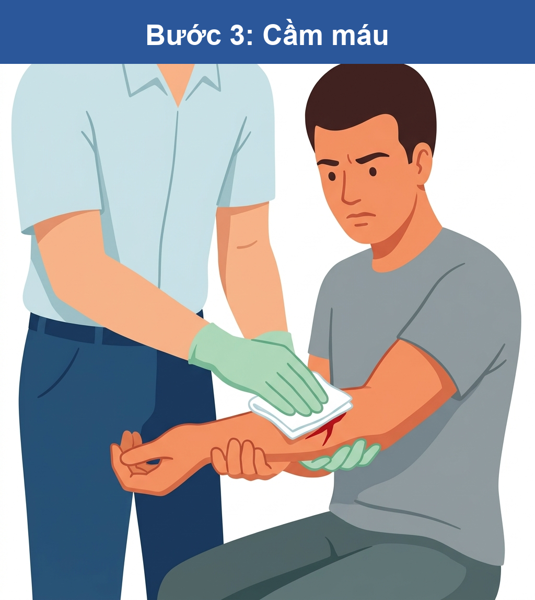
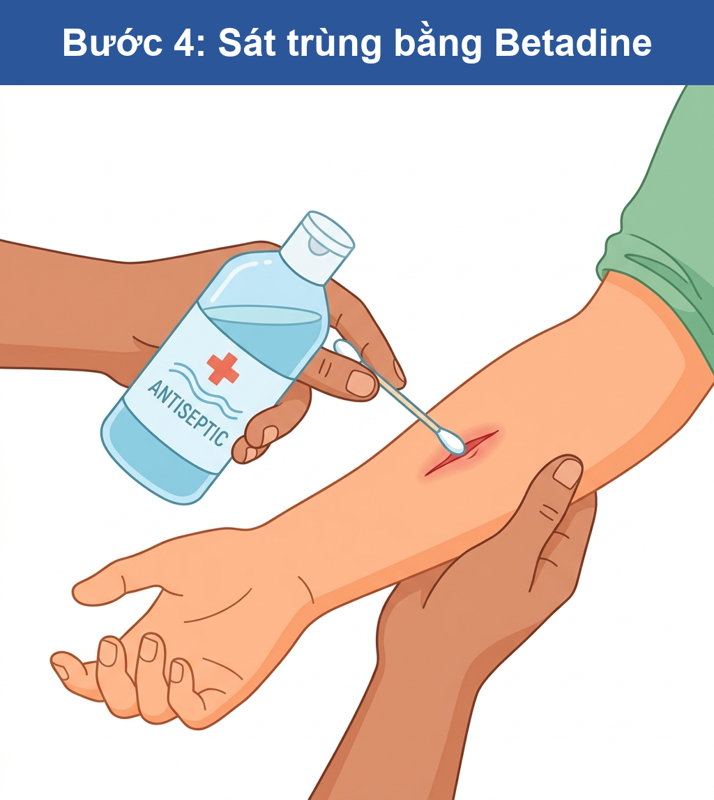
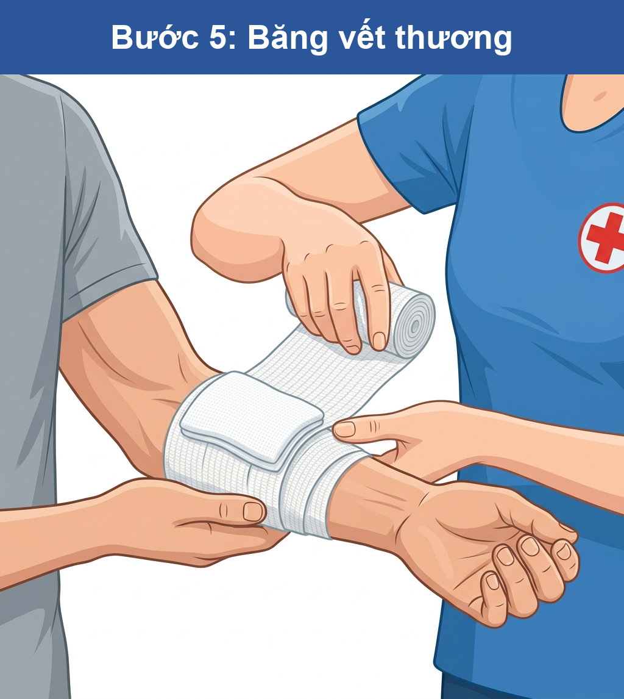
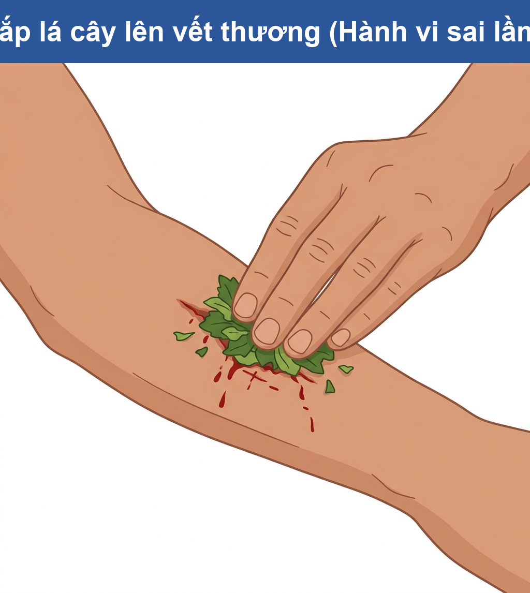

Trường:...................
Tổ:............................    Họ và tên giáo viên: ............................

## TÊN BÀI DẠY: BÀI 6.31: KỸ NĂNG SƠ CỨU VẾT THƯƠNG NHẸ
### TIẾT 1: SƠ CỨU CÁC VẾT THƯƠNG NHẸ THƯỜNG GẶP
Môn học/Hoạt động giáo dục: Kỹ năng sống / Sơ cứu cơ bản; Lớp: 6
Thời gian thực hiện: 35 – 40 phút

---

## I. MỤC TIÊU
1. **Kiến thức**:
   - Nhận biết nguyên lý sơ cứu an toàn và quy trình 5 bước sơ cứu vết thương.
   - Hiểu cơ chế xử lý chảy máu cam chuẩn y khoa.
   - Nhận diện được ranh giới nhiễm khuẩn của vết thương.

2. **Năng lực**:
   - Năng lực tự chủ và tự học.
   - Năng lực giao tiếp và hợp tác.
   - Năng lực giải quyết vấn đề.

3. **Phẩm chất**:
   - Trách nhiệm.

---

## II. THIẾT BỊ DẠY HỌC VÀ HỌC LIỆU
1. **Giáo viên**:
   - Phiếu học tập phát cho các nhóm.
   - Hệ thống slide hình ảnh minh họa dụng cụ và tình huống chấn thương.
2. **Học sinh**:
   - Dụng cụ học tập cá nhân/nhóm.
   - Bộ dụng cụ thực hành sơ cứu (Băng gạc y tế thật, nước sạch, dung dịch Betadine).

---

## III. TIẾN TRÌNH DẠY HỌC

### Hoạt động 1: Nhận diện tình huống khẩn cấp và nguyên tắc vô trùng (10 phút)
* **Giao nhiệm vụ**: GV giới thiệu tình huống giả định chấn thương tại trường. Yêu cầu HS nhóm 4 người quan sát danh sách dụng cụ (gạc, Betadine, băng keo, kem đánh răng, nước mắm) và thảo luận nhanh phác đồ 3 bước xử lý ban đầu.
* **Thực hiện & Báo cáo**: HS thảo luận, trình bày dụng cụ phù hợp. Hệ thống báo kết quả giả định: Vết thương bị nhiễm trùng nặng sau 24 giờ do lỗi sơ cứu chưa rửa tay bằng xà phòng sát khuẩn.
* **Kết luận**: GV chốt bài học cốt lõi: Vệ sinh tay của người sơ cứu là nguyên tắc bắt buộc đầu tiên.

*(Ý nghĩa: Nhấn mạnh "vệ sinh tay là nguyên tắc bắt buộc đầu tiên" trước khi chạm vào vết thương để tránh nhiễm trùng)*

---

### Hoạt động 2: Phân tích tình huống và Triệu chứng chấn thương (10 phút)
* **Giao nhiệm vụ**: GV phát phiếu tình huống ngẫu nhiên cho các nhóm, hướng dẫn HS đọc kỹ nội dung và sử dụng bút dạ quang để tìm ra từ khóa thể hiện triệu chứng và hành động sai lầm.
* **Thực hiện & Báo cáo**: HS nghiên cứu văn bản, thảo luận lọc thông tin lỗi sơ cứu dân gian. Đại diện nhóm lên trình bày, các nhóm bạn nhận xét, bổ sung.
* **Kết luận**: GV chốt đáp án các từ khóa bắt buộc: rách da đầu gối, rỉ máu, bám bụi bẩn, lấy tay bẩn bịt (TH 1); dầu mỡ nóng, rát buốt, bôi kem đánh răng (TH 2); chảy máu cam, ngửa cổ (TH 3); kiến ba khoang, cào gãi mạnh, sưng đỏ (TH 4). GV chốt kiến thức: Xác định đúng hiện trạng chấn thương là điều kiện bắt buộc để đưa ra giải pháp sơ cứu đúng.

#### Bảng hình ảnh 4 tình huống trong phiếu học tập:

| **Hình 1 (TH 1): Vết trầy xước** | **Hình 2 (TH 2): Vết bỏng nhiệt** |
| :--- | :--- |
| Vết rách da gối rỉ máu, bám bụi | Da tay đỏ rực do bỏng dầu mỡ |
| **Hình 3 (TH 3): Chảy máu cam** | **Hình 4 (TH 4): Côn trùng đốt** |
| Tư thế người hơi cúi đầu | Vết phồng rộp do kiến ba khoang |

---

### Hoạt động 3: Đánh giá nguy cơ và Đề xuất giải pháp sơ cứu (10 phút)
* **Giao nhiệm vụ & Thực hiện**: GV phát phiếu phân tích giải pháp. Yêu cầu các nhóm thảo luận điền phiếu trong 6 phút để chỉ ra nguy cơ biến chứng và đề xuất cách xử lý đúng. HS thảo luận hoàn thiện phiếu.
* **Báo cáo & Kết luận**: Đại diện nhóm thuyết trình giải pháp phản tích, nhóm khác phản biện chéo. GV làm rõ hậu quả sơ cứu sai: TH 1 (Nguy cơ uốn ván); TH 2 (Nguy cơ bỏng hóa chất/nhiễm trùng); TH 3 (Nguy cơ sặc máu khí quản do ngửa cổ); TH 4 (Nguy cơ viêm mô tế bào).

---

### Hoạt động 4: Thực hành kỹ thuật quấn băng (5 phút)
* **Chuyển giao nhiệm vụ**: GV chiếu sơ đồ phác đồ 5 bước nằm ngang. Giao nhiệm vụ các nhóm vừa tương tác sắp xếp quy trình vừa phối hợp quấn băng gạc thật lên tay/chân của bạn cùng nhóm trong 5 phút.
* **Thực hiện & Báo cáo**: HS thực hành kỹ thuật quấn băng gạc thật (nước sạch, Betadine, gạc), chú ý kiểm tra độ chặt đảm bảo tuần hoàn đầu chi. Đại diện nhóm đưa sản phẩm kiểm tra chéo.
* **Kết luận**: GV chốt quy trình 5 bước chuẩn: Rửa tay & rửa vết thương → Sát trùng rìa bằng Betadine → Che gạc & quấn băng → Theo dõi tuần hoàn đầu chi → Nâng cao chi bị thương hơn tim. GV nhận xét, khen ngợi và đánh giá đạt chuẩn.

#### Quy trình 5 bước sơ cứu & quấn băng vết thương nhẹ:

---

### Hoạt động 5: Tổng kết và phân loại hành vi (5 phút)
* **Chuyển giao nhiệm vụ & Hướng dẫn**: GV yêu cầu HS tham gia trò chơi phân loại kéo thả 8 thẻ hành vi sơ cứu vào bảng 2 cột NÊN LÀM và KHÔNG NÊN LÀM. GV cho HS cam kết tuân thủ và giao nhiệm vụ về nhà: Kiểm tra, sắp xếp lại tủ thuốc gia đình.
* **Đáp án phân loại**: NÊN LÀM (Rửa tay xà phòng, ngâm nước mát vết bỏng, cúi đầu nhẹ khi chảy máu cam, chườm lạnh khi bị ong đốt); KHÔNG NÊN LÀM (Bôi kem đánh răng lên vết bỏng, ngửa cổ khi chảy máu cam, đắp lá cây bẩn, tự dùng nhíp giật dị vật sâu).

#### Bảng biểu tượng phân loại trực quan:

| 👍 NÊN LÀM (✔️) | 👎 KHÔNG NÊN LÀM (❌) |
| :--- | :--- |
| - Rửa tay bằng xà phòng trước khi sơ cứu - Ngâm nước mát vùng bị bỏng nhiệt (15-20 phút) - Cúi đầu nhẹ và bóp cánh mũi khi chảy máu cam - Chườm lạnh khi bị ong/côn trùng đốt | - Bôi kem đánh răng hoặc mỡ trăn lên vết bỏng - Ngửa cổ ra sau khi bị chảy máu cam - Đắp lá cây bẩn lên vết thương hở - Tự dùng nhíp giật dị vật đâm sâu trong vết thương |

*(Ý nghĩa: Đắp các loại lá cây giã nhuyễn không vô trùng lên vết thương hở là nguyên nhân hàng đầu dẫn đến nhiễm trùng uốn ván và hoại tử mô tế bào).*
